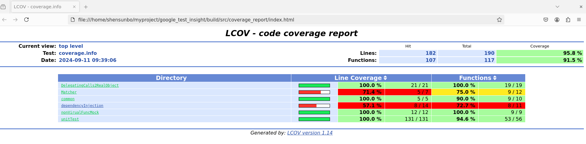

# google_test_insight
* gtest cases
* gmock cases
* code coverage report

# build 
```
mkdir build
cd build/
cmake ..
make
```

# run unit test
`../runTest.sh` 
`../runTest.sh --color -VV` 

# gcov
* compile with code coverage 
    * `cmake .. -DGEN_REPORT=ON`
* install necessary tool
    * sudo apt-get install lcov
    * sudo apt-get install xdg-utils
* run unit test and generate coverage report 
`../codeCovReport.sh`



